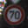
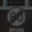
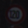
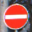
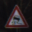
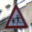
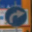
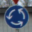

# Traffic Sign Classifier
This project uses deep neural networks and convolutional neural networks to classify [German Traffic Signs](http://benchmark.ini.rub.de/?section=gtsrb&subsection=dataset).

Usage: `python traffic_sign_trainer.py` to train and evalute the model

## German Traffic Signs Dataset
Label 00 - 09:          

Label 10 - 19:          

Label 20 - 29:          

Label 30 - 39:          

Label 40 - 42:    

This is a multi-class, single-image classification problem. The dataset is available [here](https://d17h27t6h515a5.cloudfront.net/topher/2017/February/5898cd6f_traffic-signs-data/traffic-signs-data.zip)

* The size of training set is 34,799
* The size of validatiaon set is 4,410
* The size of test set is 12,630
* The shape of a traffic sign image is (32, 32, 3)
* The number of unique traffic signs (labels) is 43

Below is the distrubtion of occurances of each image class in the training, validation and testing dataset. This can help to understand whether the dataset is uniform in terms of a baseline occurrence, and avoid potential pitfalls on biased distribution among different dataset

  

## Architecture Overview
The deep neural network architectures receives an image as input, transform it through a series of hidden layers (e.g Conv, max pooling, relu, full connected etc), and output a vector of logits. Then the logits will be used to measured the probability error in traffic sign classification with softmax and cross entropy.

My final model consisted of the following layers:

| Layer         		|     Description	        					|
|:---------------------:|:---------------------------------------------:|
| Input         		| 32x32x3 image   							|
| Convolution 5x5     	| 2x2 stride, valid padding, outputs 28x28x12 	|
| RELU					|												|
| Max pooling	      	| 2x2 stride,  outputs 14x14x12 				|
| Convolution 5x5	    | 2x2 stride, valid padding, outputs 10x10x20    |
| RELU					|												|
| Max pooling	      	| 2x2 stride,  outputs 5x5x20 				|
| RELU					|												|
| Fully connected		| input 500, output 160        									|
| RELU					|												|
| Dropout				| 50%          									|
| Fully connected		| input 160, output 100        									|
| RELU					|												|
| Dropout				| 50%         									|
| Fully connected		| input 100, output 43        									|

With this neural network architecture, along with other optimization, **the accuracy rate on the test dataset is able to achieve 96.5%**

## Training data preprocessing

Data augmentation is required on more complex object recognition tasks. I achieved it by shifting the image to four directions, i.e. left, rigth, top and down. In addition, Images were shiftted with 1 pixel and 2 pixels, and therefore I increased the training data by 8x more. During the training processes, more data effectively effectively improved the final accurancy on the test dataset.

I also tried to convert the images to different color spaces, e.g. gray (32x32x1), HLS (32x32x3), and YUV (32x32x3), hoping for prediction accurancy improvement. However, these converted images weren't able to beat the original training dataset and so I gave up this technique in the final training model.

## Model Training and Optimization
I am able to achieve the accuracy rate of 96.4% on test dataset and 98% on the validation dataset. Below are the optimization approaches incorporated in the final version.

| Approach         		|     Description	        					|
|:---------------------:|:---------------------------------------------:|
| Training dataset augmentation | This image has been shifted the left, right, up, down direction with 1 and 2 pixels. So it adds 8x more training data |
| Dropout | Applies 50% dropout rate on output of the two fully connected layers |
| L2 Regularization | Applies regularization (beta 0.01) with weights and bias of the three fully connected layers |
| Loss Function | Computes softmax cross entropy between logits and labels |

Training parameters are
* Number of epoches: 30
* Size of the training batch: 128
* Learning rate: 0.001

In addition, to avoid the over-training, instead of picking the last train model to evaluate the test dataset, when the losses  becomes mostly flat, I picked the model with highest accurancy on the validation dataset.

## Solution Approach

Started from basic LeNet architecture. Here are the approaches adopted with accurancy being improved

|  | Adopted Approach | Description	 	| Test Accuracy |
|:--:|:---------------------:|:---------------------------------------------:|:-----------:|
| Step 1 | Basic LeNet | The same LeNet used for hand-writing image (28x28x1) detection | *89.3%* |
| Step 3 | L2 Regularization / Dropout | Avoid the model to be overfitting during the training | *93.4%* |
| Step 2 | The training data augmentation | Shift the images (left/right/up/down) for more training data | *95.0%* |
| Step 4 | Increase numbers of neurals | LeNet was optimized for 28x28x1 images. Given the input images are 32x32x3, it may need more numbers of weights at each layer for better output quality | **96.5%** |

Alternative optimization approaches has also been evaluated as below. Although these approaches were tuned along with other optimizations including dropout, L2 Regularization, different numbers of neurals in the hidden layer. The final accurancy is still unable to beat the final version above. Therefore, they weren't been adopted. 

| Evaluated Approach but abandoned | Description	 	| Test Accuracy |
|:----------------------:|:---------------------------------------------:|:-----------:|
| Convert to Gray color space | Convert the RGB images (32x32x3) to grayscaled images (32x32x1). | *95.9%* |
| Convert the YUV color space | Convert the RGB (32x32x3) to YUV color space (32x32x3) | *94.9%* |
| Tune the batch size / learning rate | Increase the batch size or change learning rate, but none of them achieve obvioius accruancy rate improvement | N/A |

## Test a Model on New Images

### 100% Accurancy on newly accquired images
I accquired 36 more German traffic sign images below from the web for evaluation. The trained the model has successfully predict their types.

### Model Certainty - Softmax Probabilities
Below are 5 new images along with the prediction, images generated from the output of the convolutional layers, and softmax Probabilities

#### 1. "Turn left ahead" sign
| Original | Prediction 1	| Prediction 2 | Prediction 3 | Prediction 4 | Prediction 5 |
|:--------:|:------------:|:------------:|:------------:|:------------:|:------------:|
|          | 1.0 (**correct**)| 4.226e-10 (wrong)| 7.91e-11 (wrong)| 2.49e-11 (wrong)| 1.33e-11 (wrong)|
|||||||

Output from the first Conv layer 

Output from the second Conv layer 

#### 2. "Slippery road" sign
| Original | Prediction 1	| Prediction 2 | Prediction 3 | Prediction 4 | Prediction 5 |
|:--------:|:------------:|:------------:|:------------:|:------------:|:------------:|
|          | 1.0 (**correct**)| 2.38e-09 (wrong)| 6.70e-10 (wrong)| 3.18e-11 (wrong)| 6.98e-12 (wrong)|
|||||||

Output from the first Conv layer 

Output from the second Conv layer 

#### 3. "Speed limit (100km/h)" sign
| Original | Prediction 1	| Prediction 2 | Prediction 3 | Prediction 4 | Prediction 5 |
|:--------:|:------------:|:------------:|:------------:|:------------:|:------------:|
|          | 0.99999821 (**correct**)| 1.658e-06 (wrong)| 6.70e-08 (wrong)| 4.73e-09 (wrong)| 2.54e-10 (wrong)|
|||||||

Output from the first Conv layer 

Output from the  second Conv layer 

#### 4. "General caution" sign
| Original | Prediction 1	| Prediction 2 | Prediction 3 | Prediction 4 | Prediction 5 |
|:--------:|:------------:|:------------:|:------------:|:------------:|:------------:|
|          | 0.99993825 (**correct**)| 1.533e-05 (wrong)| 7.266e-06 (wrong)| 6.969e-06 (wrong)| 6.576e-06 (wrong)|
|||||||

Output from the  first Conv layer 

Output from the  second Conv layer 

#### 5. "Keep right" sign
| Original | Prediction 1	| Prediction 2 | Prediction 3 | Prediction 4 | Prediction 5 |
|:--------:|:------------:|:------------:|:------------:|:------------:|:------------:|
|          | 1.0 (**correct**)| 5.34e-12 (wrong)| 7.18e-13 (wrong)| 7.18e-13 (wrong)| 4.64e-14 (wrong)|
|||||||

Output from the first Conv layer 

Output from the second Conv layer 

