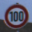
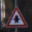
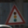
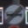

# Traffic Sign Classifier
This project uses deep neural networks and convolutional neural networks to classify [German Traffic Signs](http://benchmark.ini.rub.de/?section=gtsrb&subsection=dataset).

## German Traffic Signs Dataset
         

         

         

   

This is a multi-class, single-image classification problem. 

* The size of training set is 34,799
* The size of validatiaon set is 4,410
* The size of test set is 12,630
* The shape of a traffic sign image is (32, 32, 3)
* The number of unique classes/labels in the data set is 43

## Architecture Overview
The deep neural network architectures receives an image as input, transform it through a series of hidden layers (e.g Conv, max pooling, relu, full connected etc), and output a vector of logits. Then the logits will be used to measured the probability error in traffic sign classification with softmax and cross entropy.

My final model consisted of the following layers:

| Layer         		|     Description	        					|
|:---------------------:|:---------------------------------------------:|
| Input         		| 32x32x3 image   							|
| Convolution 5x5     	| 2x2 stride, valid padding, outputs 28x28xm 	|
| RELU					|												|
| Max pooling	      	| 2x2 stride,  outputs 14x14xm 				|
| Convolution 5x5	    | 2x2 stride, valid padding, outputs 10x10xm    |
| RELU					|												|
| Max pooling	      	| 2x2 stride,  outputs 5x5xm 				|
| Convolution 1x1	    | 2x2 stride, valid padding, outputs 1x1xm    |
| RELU					|												|
| Fully connected		| input m, output m        									|
| RELU					|												|
| Dropout				| 50%          									|
| Fully connected		| input m, output m        									|
| RELU					|												|
| Dropout				| 50%         									|
| Fully connected		| input m, output 43        									|
